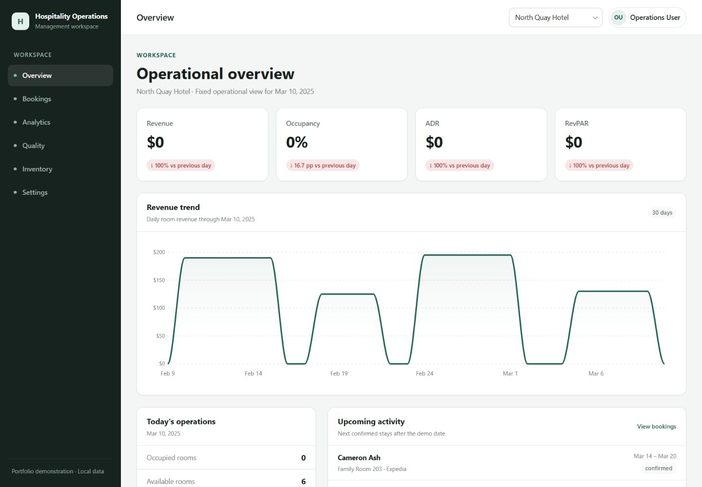
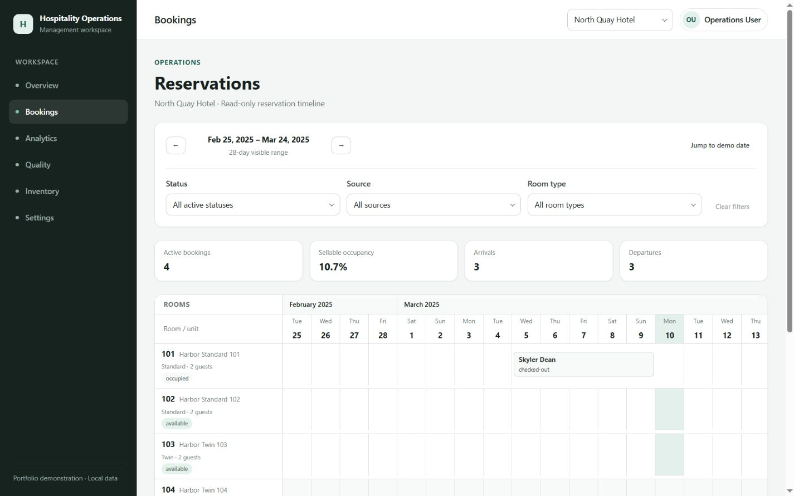
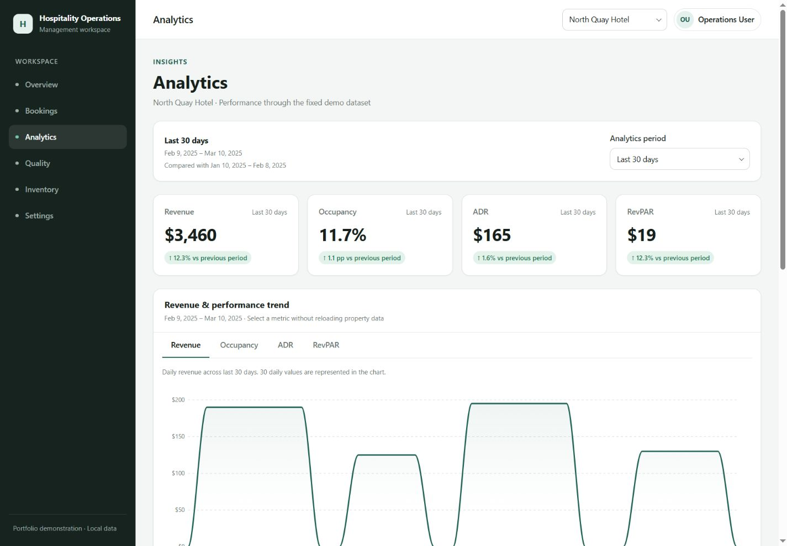
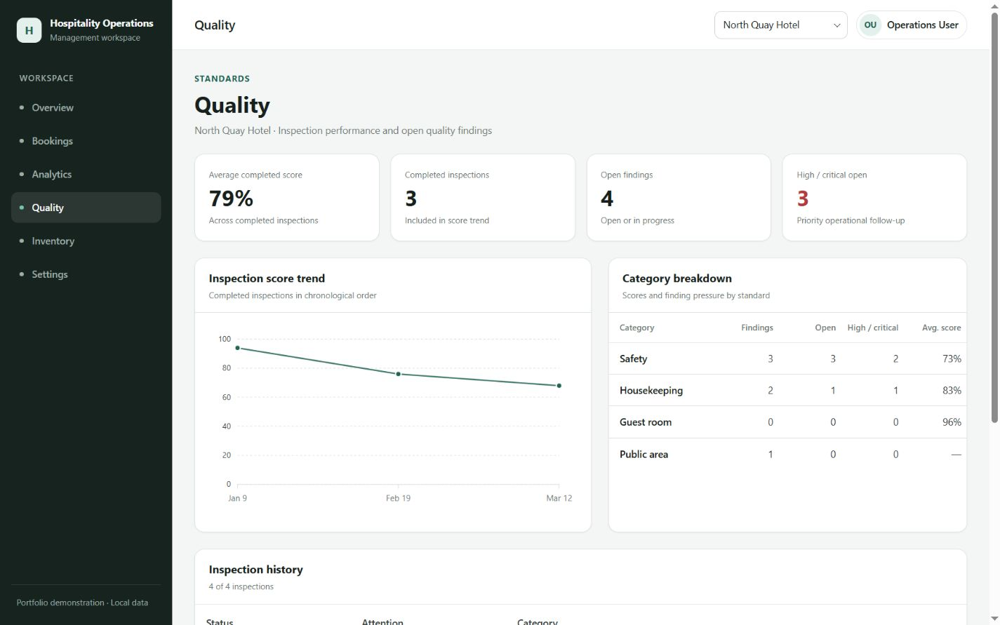
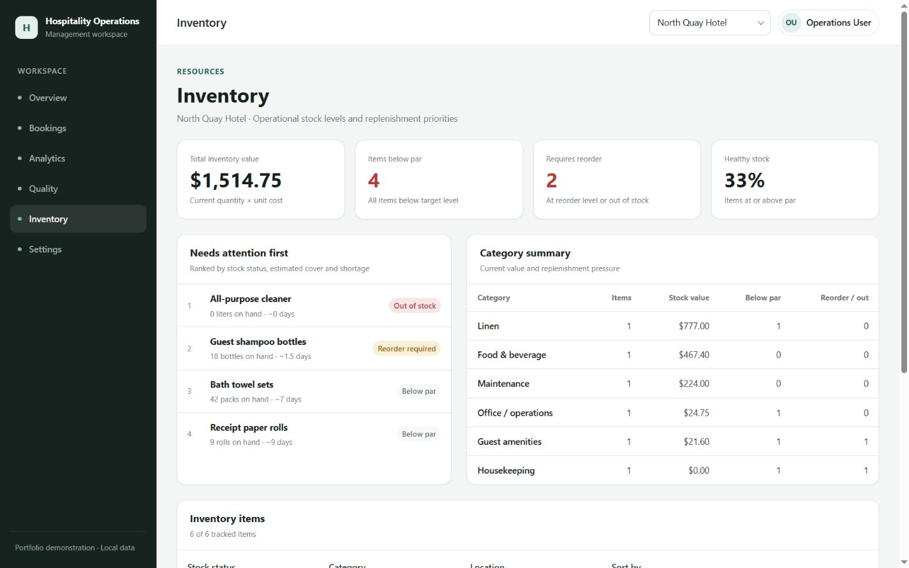
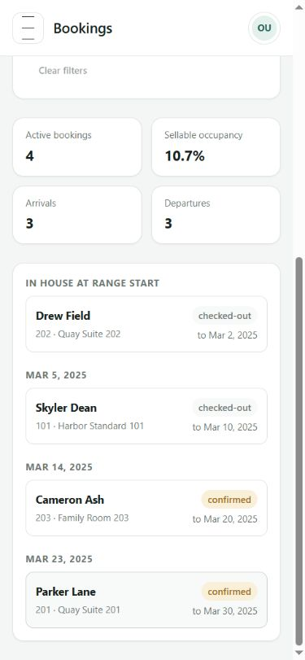
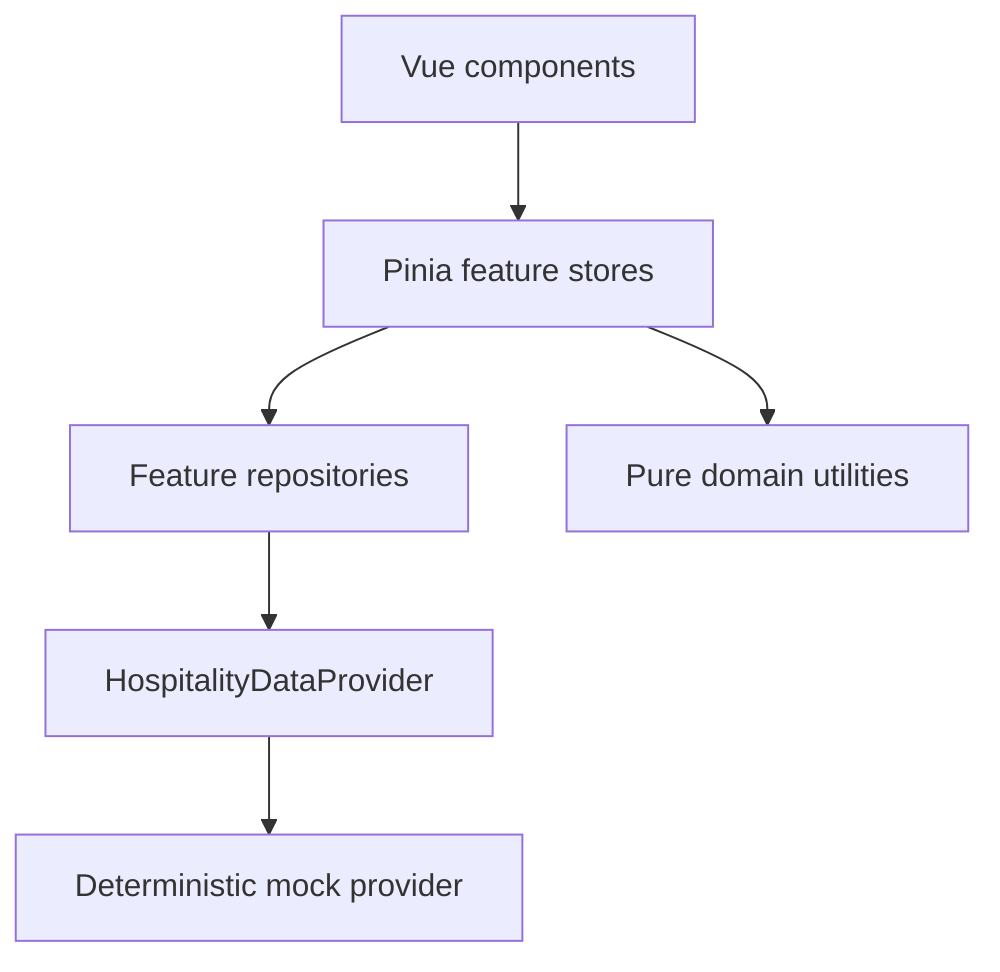

# Hospitality Operations Dashboard

A responsive hospitality operations dashboard built as a frontend portfolio project,
demonstrating reservation planning, operational analytics, quality inspections, inventory
monitoring, and property-level workspace management.

**Live Demo:** [https://hospitality-operations-dashboard.netlify.app/](https://hospitality-operations-dashboard.netlify.app/)

All properties, people, operational records, and metrics are fictional. The application uses a
deterministic local data provider; it has no backend, authentication, or connection to a real hotel
or company.

## Features

- **Overview** — property KPIs, revenue trend, arrivals and departures, and operational attention
  items.
- **Bookings** — a property-scoped reservation timeline with filters, booking details, and a
  purpose-built mobile list.
- **Analytics** — Revenue, Occupancy, ADR, and RevPAR with historical comparisons, revenue-source
  analysis, and room-type performance.
- **Quality** — inspection history, findings and severity, score trends, category analysis, and
  inspection details.
- **Inventory** — stock health, par and reorder thresholds, estimated days of stock, attention
  ranking, and category/value analysis.
- **Settings** — a read-only demo profile plus preferred property, data-density, and motion
  preferences stored locally in the browser.

## Screenshots

| Overview                                             | Bookings                                               |
| ---------------------------------------------------- | ------------------------------------------------------ |
|  |  |

| Analytics                                                | Quality                                              |
| -------------------------------------------------------- | ---------------------------------------------------- |
|  |  |

| Inventory                                               | Mobile bookings                                                  |
| ------------------------------------------------------- | ---------------------------------------------------------------- |
|  |  |

## Architecture

The project uses feature-based modules. Pages and feature-specific domain logic live under
`src/modules`; application routing and workspace state live under `src/app`; reusable UI and
shared domain concepts live under `src/shared`.



Domain types are kept with their owning feature or in the shared domain layer. Business
calculations are implemented as pure utilities, while display formatting remains outside stores.
The `HospitalityDataProvider` contract could be implemented by a real API client later; this
repository includes only its deterministic local implementation. Mock-data integrity is validated
by tests.

## What this project demonstrates

- Vue 3 Composition API and strict TypeScript organized around feature boundaries.
- Pinia state management with a shared property workspace context.
- Typed repositories and deterministic asynchronous mock APIs.
- Tested domain calculations for reservations, hospitality metrics, inspections, and stock levels.
- Responsive operational interfaces, including mobile-specific alternatives for dense data.
- Stale-response protection when properties change during asynchronous requests.
- Accessible navigation and modals with keyboard handling, focus management, and reduced motion.
- Route-level code splitting with chart dependencies isolated from the initial application bundle.

## Selected engineering decisions

- **Stable demo semantics:** operational results use a fixed reference date rather than the user's
  system clock, so the same data tells the same story on every run.
- **Reservation intervals:** stays use `[checkIn, checkOut)` semantics; checkout day is not counted
  as an occupied night.
- **Derived analytics:** occupancy, ADR, RevPAR, and comparisons are calculated from bookings and
  revenue records instead of disconnected headline values.
- **Property context:** one global property selection scopes each operational module.
- **Race handling:** feature stores ignore stale asynchronous responses after rapid property
  switching.
- **Read-only workflows:** details and operational analysis are implemented without pretending that
  local mock mutations are backend CRUD.
- **Local preferences:** preferred property, density, and motion settings use validated
  `localStorage`; operational records are never persisted.

## Demo data

The fixed demo period is **2025-01-01 through 2025-03-31**, with **2025-03-10** as the reference
date. It covers three fictional properties and deterministic bookings, revenue records,
inspections, findings, rooms, and inventory items. Integrity checks validate relationships and
cross-feature assumptions. Changing the system clock does not change operational results.

## Tech stack

- Vue 3, TypeScript, Vite
- Pinia and Vue Router
- SCSS
- ApexCharts
- Vitest, ESLint, and Prettier

Node.js **22.12+ or 24.x LTS** is supported.

## Run locally

```sh
npm install
npm run dev
```

Open the local URL printed by Vite.

## Quality checks

```sh
npm run format:check
npm run lint
npm run test
npm run build
npm run preview
```

CI runs formatting, linting, tests, and the production build for pushes to `main` and pull
requests.

## Deployment

[Netlify](https://www.netlify.com/) is the recommended static host:

- Build command: `npm run build`
- Publish directory: `dist`

The committed `public/_redirects` file provides the SPA fallback required for direct navigation or
refreshes on routes such as `/bookings`, `/analytics`, and `/quality`. No deployment credentials or
automatic deployment are included.

## Scope

This is a frontend portfolio/demo application. It intentionally has no backend, authentication,
real-time updates, or persistence for bookings, inspections, inventory, or analytics. Operational
flows are read-only; only workspace preferences are stored in the browser.
